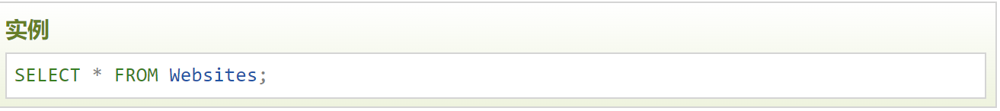

># **SQL语句**
- 您需要在数据库上执行的大部分工作都由 SQL 语句完成。
- 下面的 SQL 语句从 "Websites" 表中选取所有记录：

在本教程中，我们将为您讲解各种不同的 SQL 语句。
### 注意
* SQL 对大小写不敏感：SELECT 与 select 是相同的。
### 一些重要的SQL语句
1. SELECT - 从数据库中提取数据
2. UPDATE - 更新数据库中的数据
3. DELETE - 从数据库中删除数据
4. INSERT INTO - 向数据库中插入新数据
5. CREATE DATABASE - 创建新数据库
6. ALTER DATABASE - 修改数据库
7. CREATE TABLE - 创建新表
8. ALTER TABLE - 变更（改变）数据库表
9. DROP TABLE - 删除表
10. CREATE INDEX - 创建索引（搜索键）
11. DROP INDEX - 删除索引

>详情见链接[SQL语法|菜鸟教程](https://www.runoob.com/sql/sql-syntax.html)