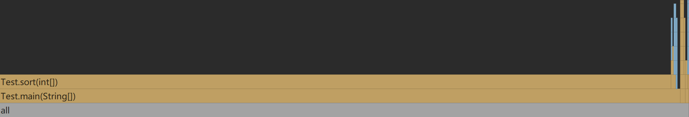

># **第三周作业**
### 请使用Java 的Profile工具探究插入排序中什么操作最耗时，并使用Markdown写出过程和结论。
>## 操作过程
1. 从官网下载Ultimate版本的IDEA [下载链接](https://www.runoob.com/sql/sql-syntax.html)；
2. 复制老师Github中插入排序的Java代码；
3. 然后点击“Profile'Main'with'Async Profile'"运行；
4. 点击Profiler上的open，得到程序运行时间大致画像如下所示：

   
   
>## 结论
- 通过图片发现sort函数耗时最高，即程序运行操作中从要插入的位置开始至最后一个数向后移动一位最为耗时。
